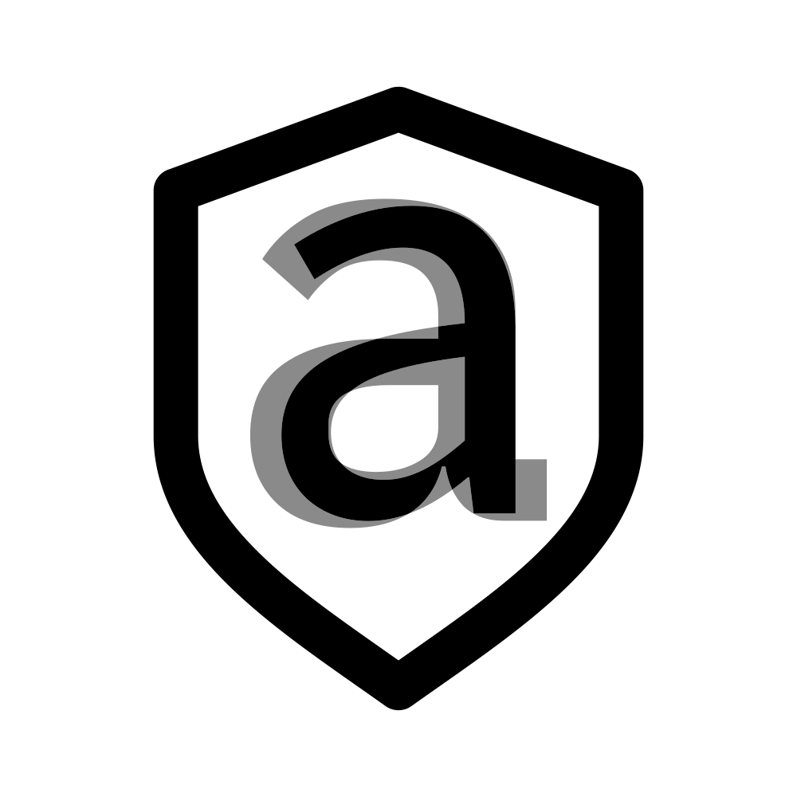

{ width="300" }

# SilverSpeak 3.0

SilverSpeak is a Python library for homoglyph-based text attacks and normalization.

## What's new in v3

- **Homoglyph Knowledge Base (HKB)**: prebuilt ranked graph (`graph.json.gz`) merging identical, TR39 confusables, OCR, and visual-neighbor data
- **Fast normalization pipeline** (default): strip invisibles → NFKC → dominant script → HKB canonical mapping. No torch at runtime
- **`NormalizeResult`**: structured output with change audit trail and ambiguity metadata (never emits U+FFFD)
- **Benchmark harness**: clean-text FPR gate and round-trip recovery metrics
- **Targeted attack** method and CLI `--pipeline fast|legacy`

## Architecture

| Tier | Entry point | When to use |
|------|-------------|-------------|
| Fast (default) | `normalize_fast()` / `python -m silverspeak normalize` | Production normalization, low latency, no ML deps |
| Legacy | `normalize_text()` / `--pipeline legacy` | Research comparison across 10 heuristic strategies |

## Quick links

- [Installation](installation.md)
- [Usage](usage.md)
- [Homoglyph Knowledge Base](hkb.md)
- [API Reference](api.md)
- [Challenges](challenges.md)
- [Legacy normalization strategies](normalization_strategies.md)
